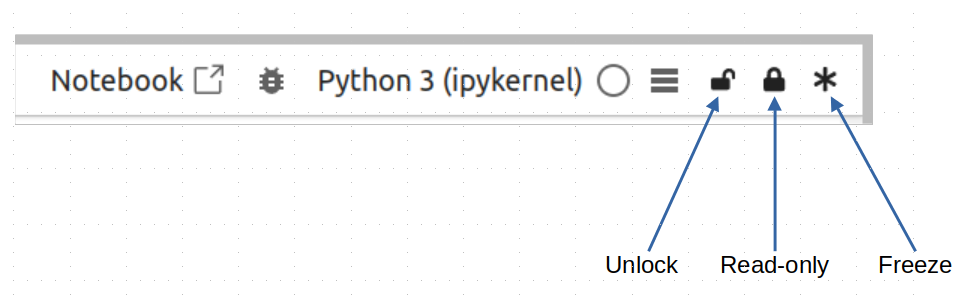

# JupyterLab Freeze (Improved)

**WORK IN PROGRESS!**

An **opinionated** version of `DataDog/jupyterlab-freeze`. 

Allows you to freeze cells in JupyterLab notebooks. This can be useful in teaching enviroments, where students can be prevented from accidentally altering code cells, or viewing the source of markdown cells that are meant purely for reading. Forked from <https://github.com/DataDog/jupyterlab-freeze>.

---

This extension allows to make cells read-only or frozen. It provides three buttons:



Namely:

- Unlocked
- Read-only
- Frozen

For **code cells**:

- _Unlocked_: The cell behaves normally.
- _Read-only_: The cell can be executed, but its input cannot be changed.
- _Frozen_: The cell cannot be edited, deleted, or executed.

For **markdown cells**:


- _Unlocked_: The cell behaves normally.
- _Read-only_: Cell markdown source can be viewed by double-clicking on it, but cannot be changed. The cell also cannot be deleted.
- _Frozen_: Cell input cannot be viewed by double-clicking on it. The cell cannot be deleted.

The individual cell's state is stored in its metadata and is applied to the cell if the extension is loaded.

## Requirements

- JupyterLab >= 4.0.0

## Install

To install the extension, execute:

```bash
pip install jupyterlab_freeze_improved
```

## Uninstall

To remove the extension, execute:

```bash
pip uninstall jupyterlab_freeze_improved
```

## JupyterHub

If you are deploying JupyterHub for the purposes of teaching, this extension can be installed for all current or future users using `pip`.

Typically, you will have installed JupyterHub in a virtual environment (named `jupyterhub` in the examples below).

Therefore, to install `jupyterlab_freeze_improved` for all users, first ensure you are in your virtual environment (in this case, located in `/opt/jupyterhub`):

```bash
$ source /opt/jupyterhub/bin/activate
```

and then install `jupyterlab_freeze_improved` using pip:

```bash
(jupyterhub)$ pip install jupyterlab_freeze_improved
```

You can view all installed/enabled extensions, as follows:

```bash
(jupyterhub)$ jupyter labextension list
```

this will output something similar to:

```bash
JupyterLab v4.2.5
/opt/jupyterhub/share/jupyter/labextensions
        jupyterlab_freeze_improved v1.0.0 enabled OK (python, jupyterlab_freeze_improved)
        jupyterlab_pygments v0.3.0 enabled OK (python, jupyterlab_pygments)
        @jupyter-notebook/lab-extension v7.2.2 enabled OK
        @jupyter-widgets/jupyterlab-manager v5.0.13 enabled OK (python, jupyterlab_widgets)
```

See <https://jupyterlab.readthedocs.io/en/4.2.x/user/extensions.html> for more information.

## Contributing

### Development install

Note: You will need NodeJS to build the extension package.

The `jlpm` command is JupyterLab's pinned version of
[yarn](https://yarnpkg.com/) that is installed with JupyterLab. You may use
`yarn` or `npm` in lieu of `jlpm` below.

```bash
# Clone the repo to your local environment
# Change directory to the jupyterlab_freeze_improved directory
# Install package in development mode
pip install -e "."
# Link your development version of the extension with JupyterLab
jupyter labextension develop . --overwrite
# Rebuild extension Typescript source after making changes
jlpm build
```

You can watch the source directory and run JupyterLab at the same time in different terminals to watch for changes in the extension's source and automatically rebuild the extension.

```bash
# Watch the source directory in one terminal, automatically rebuilding when needed
jlpm watch
# Run JupyterLab in another terminal
jupyter lab
```

With the watch command running, every saved change will immediately be built locally and available in your running JupyterLab. Refresh JupyterLab to load the change in your browser (you may need to wait several seconds for the extension to be rebuilt).

By default, the `jlpm build` command generates the source maps for this extension to make it easier to debug using the browser dev tools. To also generate source maps for the JupyterLab core extensions, you can run the following command:

```bash
jupyter lab build --minimize=False
```

### Development uninstall

```bash
pip uninstall jupyterlab_freeze_improved
```

In development mode, you will also need to remove the symlink created by `jupyter labextension develop`
command. To find its location, you can run `jupyter labextension list` to figure out where the `labextensions`
folder is located. Then you can remove the symlink named `jupyterlab_freeze_improved` within that folder.

### Testing the extension

#### Frontend tests

This extension is using [Jest](https://jestjs.io/) for JavaScript code testing.

To execute them, execute:

```sh
jlpm
jlpm test
```

#### Integration tests

This extension uses [Playwright](https://playwright.dev/docs/intro) for the integration tests (aka user level tests).
More precisely, the JupyterLab helper [Galata](https://github.com/jupyterlab/jupyterlab/tree/master/galata) is used to handle testing the extension in JupyterLab.

More information are provided within the [ui-tests](./ui-tests/README.md) README.

### Packaging the extension

See [RELEASE](RELEASE.md)

### Notes

The `DataDog/jupyterlab-freeze` extension is based on the freeze extension by [jupyter_contrib_nbextensions](https://github.com/ipython-contrib/jupyter_contrib_nbextensions/tree/master/src/jupyter_contrib_nbextensions/nbextensions/freeze).